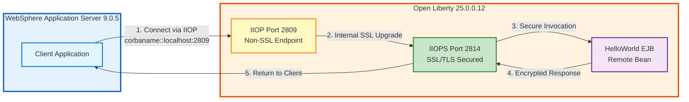
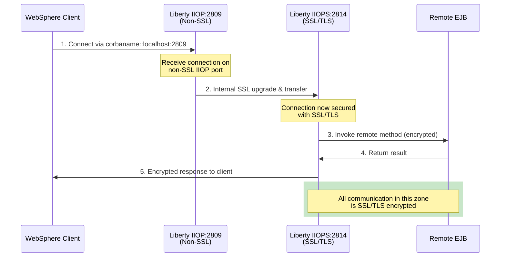

# Remote EJB Communication: WebSphere to Liberty with SSL

## Overview

This project demonstrates Remote EJB invocation from WebSphere Application Server to Open Liberty using IIOP (Internet Inter-ORB Protocol). A critical aspect of this configuration is the SSL/TLS setup, where **WebSphere clients must connect to Liberty's non-SSL IIOP port, which then automatically transfers the connection to the SSL-secured IIOPS port**.

## Architecture



## Key Concept: Non-SSL to SSL Port Transfer

### Why This Approach?

When Liberty is configured with SSL/TLS for IIOP communication, the server exposes two ports:

1. **IIOP Port (2809)** - Non-SSL endpoint
2. **IIOPS Port (2814)** - SSL-secured endpoint

**Critical Configuration Rule**: WebSphere clients connecting to a Liberty server with SSL enabled **must initially connect to the non-SSL IIOP port (2809)**. Liberty's ORB (Object Request Broker) automatically handles the SSL upgrade and transfers the connection to the secure IIOPS port (2814).

### Connection Flow



## Project Structure

```
WAStoLibertyEJB/
├── README.md                      # This file
├── HelloWorldServer/              # Liberty Server (Jakarta EE 10)
│   ├── pom.xml
│   ├── src/main/
│   │   ├── java/com/ibm/example/
│   │   │   ├── HelloWorldBean.java       # Remote EJB implementation
│   │   │   ├── HelloWorldRemote.java     # Remote interface
│   │   │   ├── HelloWorldController.java # JSF controller
│   │   │   └── HelloWorldTestServlet.java
│   │   ├── liberty/config/
│   │   │   ├── server.xml                # Liberty configuration with SSL
│   │   │   ├── boostrap.properties
│   │   │   └── resources/security/
│   │   │       ├── key.p12               # Server keystore
│   │   │       ├── trust.p12             # Server truststore
│   │   │       └── default.cer           # Exported certificate
│   │   └── webapp/
│   │       ├── index.xhtml
│   │       └── WEB-INF/
│   │           ├── beans.xml
│   │           └── web.xml
│   └── target/                    # Build output
│
└── HelloWorldClient/              # WebSphere Client (Java EE 7)
    ├── pom.xml
    ├── src/main/java/com/ibm/example/
    │   ├── HelloWorldClient.java         # EJB client implementation
    │   ├── HelloWorldClientServlet.java  # Servlet wrapper
    │   ├── HelloWorldRemote.java         # Remote interface (shared)
    │   ├── HelloWorldRestResource.java   # REST endpoint
    │   └── RestApplication.java
    └── target/                    # Build output
```

## Liberty Server Configuration

### Key Configuration Elements

| Element | Purpose | SSL Impact |
|---------|---------|------------|
| `<iiopEndpoint>` | Defines non-SSL IIOP port (2809) | Entry point for WebSphere clients |
| `<iiopsOptions>` | Defines SSL IIOPS port (2814) | Target port after SSL upgrade |
| `<transportLayer sslEnabled="true">` | Enables SSL for IIOP transport | Forces SSL upgrade on connection |
| `<ssl>` | References keystores | Provides certificates for SSL handshake |
| `<serverPolicy.csiv2>` | CSIv2 security policy | Controls authentication and transport security |

## WebSphere Client Configuration

### Client Code

The `HelloWorldClient/src/main/java/com/ibm/example/HelloWorldClient.java` demonstrates the correct connection approach:

```java
public void initialize(String schema, String protocol, String host, String port) 
    throws NamingException {
    
    Properties props = new Properties();
    props.put(Context.INITIAL_CONTEXT_FACTORY, 
              "com.ibm.websphere.naming.WsnInitialContextFactory");
    
    // CRITICAL: Use non-SSL IIOP port (2809), NOT IIOPS port (2814)
    props.put(Context.PROVIDER_URL, 
              schema + ":" + protocol + ":" + host + ":" + port);
    // Example: "corbaname::localhost:2809"
    
    InitialContext ctx = new InitialContext(props);
    String jndiName = "ejb/global/HelloWorldServer/HelloWorldBean!com.ibm.example.HelloWorldRemote";
    
    helloWorldRemote = (HelloWorldRemote) ctx.lookup(jndiName);
}
```

### Connection Parameters

```java
// Correct configuration for SSL-enabled Liberty
private static final String WAS_HOST = "localhost";
private static final String WAS_IIOP_PORT = "2809";      // Non-SSL port
private static final String WAS_SCHEMA = "corbaname";
private static final String WAS_PROTOCOL = "";           // Empty = IIOP (not IIOPS)
```

**Important**: The protocol should be empty or "iiop", **never "iiops"** when connecting to Liberty with SSL enabled.

## SSL Certificate Management

### Certificate Files

Located in `HelloWorldServer/src/main/liberty/config/resources/security/`:

- **`key.p12`** - Server's private key and certificate
- **`trust.p12`** - Trusted certificates (for mutual TLS if needed)
- **`default.cer`** - Exported certificate for client trust

#### Import to WebSphere Trust Store

On the WebSphere server, import Liberty's certificate:

```bash
keytool -importcert -alias libertyServer \
  -file default.cer \
  -keystore $WAS_HOME/profiles/AppSrv01/etc/trust.p12 \
  -storetype PKCS12 \
  -storepass WebAS
```

## Building the Project

### Build Liberty Server

```bash
cd HelloWorldServer
mvn clean package
```

This creates `target/HelloWorldServer.war`

### Build WebSphere Client

```bash
cd HelloWorldClient
mvn clean package
```

This creates `target/helloworldclient.war`

## Running the Project

### 1. Start Liberty Server

Using Maven Liberty plugin:

```bash
cd HelloWorldServer
mvn liberty:dev
```

Or manually:

```bash
cd HelloWorldServer
mvn liberty:run
```

The server will start on:
- HTTPS: https://localhost:9443
- IIOP: localhost:2809 (non-SSL)
- IIOPS: localhost:2814 (SSL)

### 2. Deploy Client to WebSphere

1. Build the client WAR file
2. Access WebSphere Admin Console
3. Navigate to Applications → New Application → New Enterprise Application
4. Upload `helloworldclient.war`
5. Follow the deployment wizard
6. Start the application

### 3. Test the Connection

Access the client application:
- WebSphere: http://your-was-server:9080/helloworldclient/hello
- Or use the REST endpoint: http://your-was-server:9080/helloworldclient/api/hello

## References

- [Open Liberty IIOP Configuration](https://openliberty.io/docs/latest/reference/config/iiopEndpoint.html)
- [WebSphere to Liberty Migration Guide](https://www.ibm.com/docs/en/was-liberty/base?topic=liberty-migrating-websphere-application-server)
- [Jakarta Enterprise Beans Specification](https://jakarta.ee/specifications/enterprise-beans/4.0/)
- [CSIv2 Security Protocol](https://www.omg.org/spec/SEC/1.8/PDF)
- [Liberty SSL Configuration](https://openliberty.io/docs/latest/reference/config/ssl.html)
